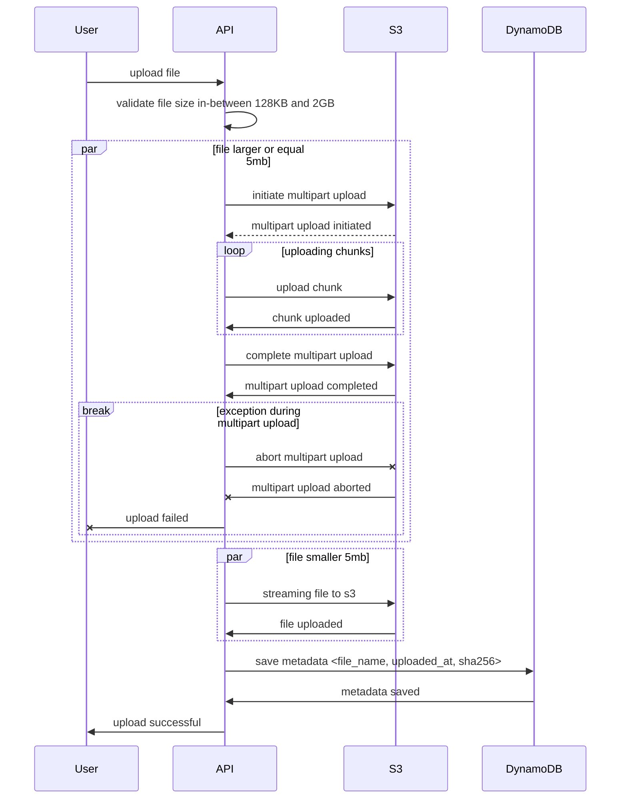

# File Storage System - Documentation

## Overview

This project implements a file storage system using AWS services simulated with LocalStack. It provides RESTful endpoints to upload files using ASP.NET Core Web API and integrates with AWS S3 and DynamoDB.

## Features

- Upload files to S3
- Compute SHA-256 hash of uploaded files
- Store file metadata in DynamoDB
- Ensure memory and disk usage requirements are met
- Unit tests for core functionality

## System Design

### Upload File Endpoint

**Endpoint:** `POST /filestorage`

**Description:**

- Accepts a file upload between 128KB and 2GB (must be sent as form-data in the request body)
- Streams file directly to S3 without storing it in memory or disk
- Computes the **SHA-256** hash while streaming
- Saves metadata (`Filename`, `UploadedAt`, `SHA-256`) in DynamoDB.

**Sequence Diagram:**



## Setup and Running the Application

### Pre-requisites

- Docker
- .NET SDK 8.0+
- make
- jq
- aws-cli

### Setup

1. Start LocalStack and the API:
   ```sh
   make up
   ```
2. Verify everything is running:
   ```sh
   make check
   ```
   Expected Output:
   ```
   DynamoDB Table: Files
   S3 Bucket: storage
   FileStorage API: Healthy
   ```

### Useful Commands

- Stop all containers:
  ```sh
  make down
  ```
- View logs:
  ```sh
  make logs
  ```
- List stored files in S3 and DynamoDB:
  ```sh
  make storage
  ```

## Testing

- Unit tests ensure correctness of file upload and metadata storage.
- Run tests:
  ```sh
  dotnet test
  ```

## Notes

- A logging middleware was developed to track all requests and responses of the server.
